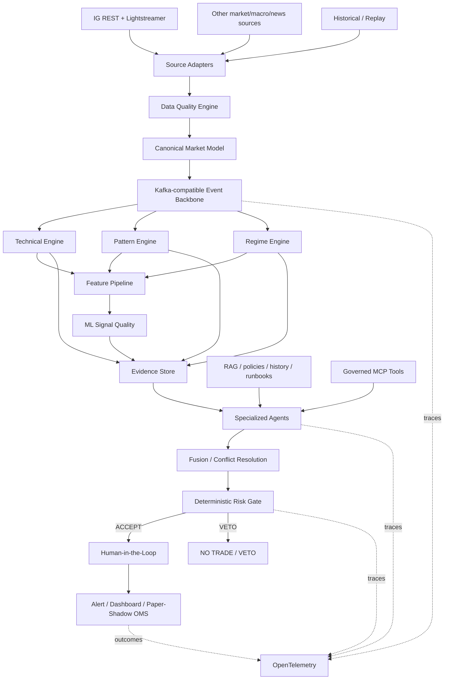

# Target Architecture

## End-to-end logical view



## Canonical market event

Minimum conceptual fields:

```yaml
instrument_id: string
venue: string
source: string
source_timestamp: timestamp
ingest_timestamp: timestamp
bid: decimal
ask: decimal
mid: decimal|null
spread: decimal
market_status: string
latency_ms: number
staleness_ms: number
quality_status: GOOD|DEGRADED|STALE|INVALID
sequence: string|null
correlation_id: string
```

The platform never combines prices without preserving source identity and quality. For an IG-targeted operation, IG remains the execution reference.

## C4-style containers

| Container | Responsibility | Primary state |
|---|---|---|
| Source adapters | REST/stream authentication, reconnect, normalization | ephemeral/session |
| Data Quality | validate timing, spread, duplicates, gaps, staleness | quality events |
| Event backbone | decouple/replay domain events | event log |
| Quant engines | indicators, structure, patterns, regimes | deterministic derived state |
| Feature service | feature generation and versioning | feature datasets |
| ML service | training/scoring/calibration/monitoring | model artifacts + predictions |
| RAG service | retrieve governed knowledge/evidence | vector/document indexes |
| MCP gateway/servers | controlled tool surface | audited calls |
| Agent orchestrator | evidence synthesis and conflict handling | agent state |
| Risk engine | deterministic hard constraints and veto | policy/risk state |
| Workflow/HITL | approval and decision lifecycle | workflow DB |
| Paper OMS | simulated orders and outcomes | paper orders/fills |
| Observability | traces, metrics, logs, evaluation | telemetry stores |

## Deterministic / ML / LLM boundary

### Deterministic

Indicators, market structure, pattern conditions, position sizing, hard risk controls, freshness rules, session rules and arithmetic.

### ML

Classification/ranking, signal quality, regime/anomaly support, calibrated estimate of an explicitly defined outcome such as `TP-before-SL`, and feature importance. ML output never overrides hard risk.

### LLM / agents

Orchestration, evidence retrieval, synthesis, comparison, explanation, tool calling and escalation. Agents must be able to return `UNKNOWN`, `DATA_STALE` and `CONFLICT` rather than manufacture certainty.

## Runtime target

### Development

- Windows/WSL or local Python for fast tests;
- OpenShift Local / CRC for Kubernetes/OpenShift validation;
- Ollama may run outside CRC if local GPU/RAM constraints make that more efficient;
- Redpanda may be used as a Kafka-compatible lab bus, subject to its BSL licensing constraints.

### Enterprise OpenShift

- OpenShift/ARO;
- Kafka or an approved Kafka-compatible platform;
- OpenShift AI where model lifecycle/serving benefits justify it;
- KServe/vLLM for supported serving patterns;
- Argo CD + Kustomize/Helm;
- OIDC, RBAC, secrets management, NetworkPolicy and policy-as-code.

### Azure

Portable workloads remain on OpenShift/ARO where appropriate. Azure-native integrations may include Entra ID, Key Vault, private networking, Azure Monitor, Microsoft Foundry/Azure OpenAI and Event Hubs only where an ADR justifies the coupling.

## Resilience principles

- reconnect/re-authenticate streaming sources;
- detect stale feeds rather than silently reuse old values;
- idempotent event handling and correlation IDs;
- replayable domain events;
- timeouts/circuit breakers on model and MCP calls;
- fail closed for risk-sensitive tool calls;
- degrade to deterministic analysis when LLM/RAG is unavailable;
- persist enough evidence to reconstruct a decision.
